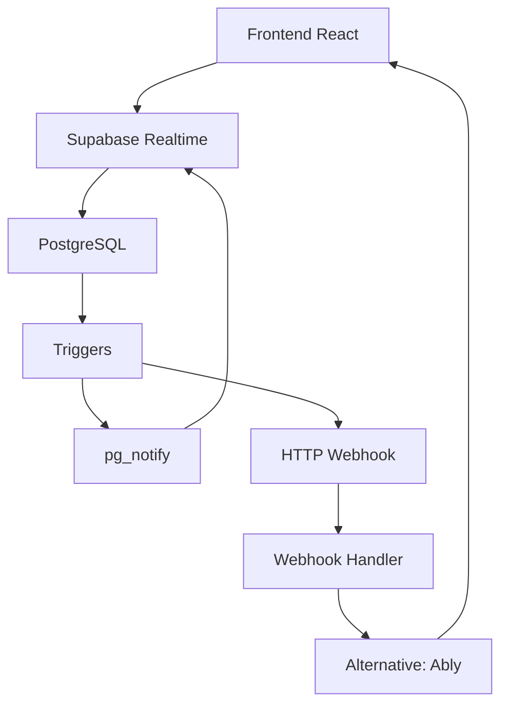

# 🔌 WebSockets Implementation Plan - Calls System

## 📋 Visão Geral

Implementação de WebSockets para atualizações em tempo real no sistema de calls usando **Supabase Realtime** como solução principal, com **Ably** como alternativa para casos específicos.

## 🎯 Casos de Uso Identificados

### 1. **Dashboard em Tempo Real**
- ✅ Métricas atualizadas automaticamente
- ✅ Gráficos dinâmicos
- ✅ Contadores de calls ativas

### 2. **Lista de Calls**
- ✅ Novas calls aparecem automaticamente
- ✅ Status updates (processing → analyzed)
- ✅ Score updates quando análise completa

### 3. **Detalhes da Call**
- ✅ Transcrição em tempo real
- ✅ Análise de IA progressiva
- ✅ Comentários colaborativos

### 4. **Notificações**
- ✅ Call perdida
- ✅ Score alto/baixo
- ✅ Análise completada

## 🏗️ Arquitetura Proposta



## 🔧 Implementação Supabase Realtime

### 1. **Setup Básico**

```typescript
// realtime/supabaseRealtime.ts
import { supabase } from '../services/supabaseClient';
import { RealtimeChannel } from '@supabase/supabase-js';

export class CallsRealtimeService {
  private channels: Map<string, RealtimeChannel> = new Map();
  private listeners: Map<string, Set<Function>> = new Map();

  // Configurar canal para tabela calls
  setupCallsChannel(): RealtimeChannel {
    const channel = supabase
      .channel('calls-changes')
      .on(
        'postgres_changes',
        {
          event: '*', // INSERT, UPDATE, DELETE
          schema: 'public',
          table: 'calls'
        },
        (payload) => this.handleCallsChange(payload)
      )
      .on(
        'postgres_changes',
        {
          event: '*',
          schema: 'public',
          table: 'calls_enriched' // View materializada
        },
        (payload) => this.handleEnrichedCallsChange(payload)
      )
      .subscribe();

    this.channels.set('calls', channel);
    return channel;
  }

  // Handler para mudanças em calls
  private handleCallsChange(payload: any) {
    const { eventType, new: newRecord, old: oldRecord } = payload;
    
    console.log('🔄 Call change detected:', eventType, newRecord?.id);
    
    // Notificar listeners específicos
    this.notifyListeners('call-changed', {
      type: eventType,
      call: newRecord || oldRecord,
      previous: oldRecord
    });

    // Casos específicos
    switch (eventType) {
      case 'INSERT':
        this.notifyListeners('call-created', newRecord);
        break;
      case 'UPDATE':
        this.handleCallUpdate(newRecord, oldRecord);
        break;
      case 'DELETE':
        this.notifyListeners('call-deleted', oldRecord);
        break;
    }
  }

  // Handler específico para updates
  private handleCallUpdate(newRecord: any, oldRecord: any) {
    // Status mudou
    if (newRecord.status !== oldRecord.status) {
      this.notifyListeners('call-status-changed', {
        callId: newRecord.id,
        oldStatus: oldRecord.status,
        newStatus: newRecord.status,
        call: newRecord
      });
    }

    // Transcrição adicionada/atualizada
    if (newRecord.transcription !== oldRecord.transcription) {
      this.notifyListeners('call-transcription-updated', {
        callId: newRecord.id,
        transcription: newRecord.transcription,
        call: newRecord
      });
    }

    // Score atualizado
    if (JSON.stringify(newRecord.scorecard) !== JSON.stringify(oldRecord.scorecard)) {
      this.notifyListeners('call-score-updated', {
        callId: newRecord.id,
        scorecard: newRecord.scorecard,
        call: newRecord
      });
    }

    // Análise de IA completada
    if (newRecord.ai_status === 'completed' && oldRecord.ai_status !== 'completed') {
      this.notifyListeners('call-analysis-completed', {
        callId: newRecord.id,
        insights: newRecord.insights,
        call: newRecord
      });
    }
  }

  // Sistema de listeners
  addListener(event: string, callback: Function): () => void {
    if (!this.listeners.has(event)) {
      this.listeners.set(event, new Set());
    }
    
    this.listeners.get(event)!.add(callback);
    
    // Retornar função de cleanup
    return () => {
      this.listeners.get(event)?.delete(callback);
    };
  }

  private notifyListeners(event: string, data: any) {
    const eventListeners = this.listeners.get(event);
    if (eventListeners) {
      eventListeners.forEach(callback => {
        try {
          callback(data);
        } catch (error) {
          console.error(`Error in ${event} listener:`, error);
        }
      });
    }
  }

  // Cleanup
  disconnect() {
    this.channels.forEach(channel => {
      supabase.removeChannel(channel);
    });
    this.channels.clear();
    this.listeners.clear();
  }
}

// Singleton instance
export const callsRealtime = new CallsRealtimeService();
```

### 2. **React Hooks para Realtime**

```typescript
// hooks/useCallsRealtime.ts
import { useEffect, useState, useCallback } from 'react';
import { callsRealtime } from '../realtime/supabaseRealtime';

export function useCallsRealtime() {
  const [isConnected, setIsConnected] = useState(false);

  useEffect(() => {
    // Setup channel
    const channel = callsRealtime.setupCallsChannel();
    
    // Monitor connection status
    channel.on('system', {}, (payload) => {
      if (payload.extension === 'postgres_changes') {
        setIsConnected(payload.status === 'ok');
      }
    });

    return () => {
      callsRealtime.disconnect();
      setIsConnected(false);
    };
  }, []);

  return { isConnected };
}

export function useCallUpdates(callId?: string) {
  const [call, setCall] = useState<any>(null);
  const [lastUpdate, setLastUpdate] = useState<Date | null>(null);

  useEffect(() => {
    if (!callId) return;

    const unsubscribe = callsRealtime.addListener('call-changed', (data) => {
      if (data.call?.id === callId) {
        setCall(data.call);
        setLastUpdate(new Date());
      }
    });

    return unsubscribe;
  }, [callId]);

  return { call, lastUpdate };
}

export function useCallsList() {
  const [calls, setCalls] = useState<any[]>([]);
  const [newCallsCount, setNewCallsCount] = useState(0);

  const markAsRead = useCallback(() => {
    setNewCallsCount(0);
  }, []);

  useEffect(() => {
    // Listen for new calls
    const unsubscribeNew = callsRealtime.addListener('call-created', (newCall) => {
      setCalls(prev => [newCall, ...prev]);
      setNewCallsCount(prev => prev + 1);
    });

    // Listen for call updates
    const unsubscribeUpdate = callsRealtime.addListener('call-changed', (data) => {
      setCalls(prev => prev.map(call => 
        call.id === data.call.id ? data.call : call
      ));
    });

    // Listen for call deletions
    const unsubscribeDelete = callsRealtime.addListener('call-deleted', (deletedCall) => {
      setCalls(prev => prev.filter(call => call.id !== deletedCall.id));
    });

    return () => {
      unsubscribeNew();
      unsubscribeUpdate();
      unsubscribeDelete();
    };
  }, []);

  return { calls, newCallsCount, markAsRead };
}

export function useDashboardMetrics() {
  const [metrics, setMetrics] = useState<any>(null);
  const [isLive, setIsLive] = useState(false);

  useEffect(() => {
    // Listen for any call changes that might affect metrics
    const unsubscribe = callsRealtime.addListener('call-changed', () => {
      setIsLive(true);
      // Debounce metrics refresh
      const timer = setTimeout(() => {
        // Trigger metrics refresh
        // This could call the service to get fresh metrics
        setIsLive(false);
      }, 2000);

      return () => clearTimeout(timer);
    });

    return unsubscribe;
  }, []);

  return { metrics, isLive };
}
```

### 3. **Componentes React com Realtime**

```typescript
// components/RealtimeCallsList.tsx
import React from 'react';
import { useCallsList, useCallsRealtime } from '../hooks/useCallsRealtime';

export function RealtimeCallsList() {
  const { isConnected } = useCallsRealtime();
  const { calls, newCallsCount, markAsRead } = useCallsList();

  return (
    <div className="calls-list">
      {/* Connection Status */}
      <div className={`connection-status ${isConnected ? 'connected' : 'disconnected'}`}>
        {isConnected ? '🟢 Conectado' : '🔴 Desconectado'}
      </div>

      {/* New Calls Indicator */}
      {newCallsCount > 0 && (
        <div className="new-calls-banner" onClick={markAsRead}>
          📞 {newCallsCount} nova(s) call(s) - Clique para marcar como lida(s)
        </div>
      )}

      {/* Calls List */}
      {calls.map(call => (
        <CallItem 
          key={call.id} 
          call={call}
          isNew={/* logic to determine if new */}
        />
      ))}
    </div>
  );
}

// components/RealtimeCallDetails.tsx
export function RealtimeCallDetails({ callId }: { callId: string }) {
  const { call, lastUpdate } = useCallUpdates(callId);
  const [transcriptionProgress, setTranscriptionProgress] = useState(0);

  useEffect(() => {
    // Listen for transcription updates
    const unsubscribe = callsRealtime.addListener('call-transcription-updated', (data) => {
      if (data.callId === callId) {
        // Animate transcription update
        setTranscriptionProgress(100);
        setTimeout(() => setTranscriptionProgress(0), 2000);
      }
    });

    return unsubscribe;
  }, [callId]);

  return (
    <div className="call-details">
      {lastUpdate && (
        <div className="last-update">
          Última atualização: {lastUpdate.toLocaleTimeString()}
        </div>
      )}

      {/* Transcription with progress indicator */}
      <div className="transcription-section">
        <h3>Transcrição</h3>
        {transcriptionProgress > 0 && (
          <div className="progress-bar">
            <div 
              className="progress-fill" 
              style={{ width: `${transcriptionProgress}%` }}
            />
          </div>
        )}
        <div className="transcription-text">
          {call?.transcription || 'Aguardando transcrição...'}
        </div>
      </div>

      {/* Real-time score updates */}
      <div className="score-section">
        <h3>Score</h3>
        <div className={`score-value ${call?.score ? 'has-score' : 'pending'}`}>
          {call?.score || 'Analisando...'}
        </div>
      </div>
    </div>
  );
}
```

## 🔄 Triggers SQL para Realtime

```sql
-- triggers/realtime_triggers.sql

-- Trigger para notificar mudanças em calls
CREATE OR REPLACE FUNCTION notify_calls_change()
RETURNS trigger
LANGUAGE plpgsql
AS $$
BEGIN
  -- Notificar via pg_notify para sistemas externos
  PERFORM pg_notify('calls_changed', json_build_object(
    'operation', TG_OP,
    'table', TG_TABLE_NAME,
    'id', COALESCE(NEW.id, OLD.id),
    'timestamp', NOW()
  )::text);

  -- Para Supabase Realtime, apenas retornar o record
  -- (Supabase detecta automaticamente mudanças na tabela)
  RETURN COALESCE(NEW, OLD);
END;
$$;

-- Aplicar trigger na tabela calls
DROP TRIGGER IF EXISTS trigger_notify_calls_change ON calls;
CREATE TRIGGER trigger_notify_calls_change
  AFTER INSERT OR UPDATE OR DELETE ON calls
  FOR EACH ROW
  EXECUTE FUNCTION notify_calls_change();

-- Trigger específico para refresh da view materializada
CREATE OR REPLACE FUNCTION trigger_refresh_enriched_view()
RETURNS trigger
LANGUAGE plpgsql
AS $$
BEGIN
  -- Agendar refresh da view materializada
  PERFORM pg_notify('refresh_materialized_view', json_build_object(
    'view_name', 'calls_enriched',
    'trigger_table', TG_TABLE_NAME,
    'operation', TG_OP,
    'timestamp', NOW()
  )::text);

  RETURN COALESCE(NEW, OLD);
END;
$$;

-- Aplicar trigger para refresh automático
DROP TRIGGER IF EXISTS trigger_refresh_enriched_view ON calls;
CREATE TRIGGER trigger_refresh_enriched_view
  AFTER INSERT OR UPDATE OR DELETE ON calls
  FOR EACH STATEMENT -- Por statement, não por row
  EXECUTE FUNCTION trigger_refresh_enriched_view();
```

## 📱 Configuração para Mobile (React Native)

```typescript
// mobile/RealtimeService.ts
import { AppState, AppStateStatus } from 'react-native';
import { callsRealtime } from '../realtime/supabaseRealtime';

class MobileRealtimeService {
  private appState: AppStateStatus = AppState.currentState;
  private reconnectTimer?: NodeJS.Timeout;

  init() {
    // Monitor app state changes
    AppState.addEventListener('change', this.handleAppStateChange);
    
    // Setup initial connection
    this.connect();
  }

  private handleAppStateChange = (nextAppState: AppStateStatus) => {
    if (this.appState.match(/inactive|background/) && nextAppState === 'active') {
      // App voltou para foreground - reconectar
      this.connect();
    } else if (nextAppState.match(/inactive|background/)) {
      // App foi para background - desconectar para economizar bateria
      this.disconnect();
    }

    this.appState = nextAppState;
  };

  private connect() {
    callsRealtime.setupCallsChannel();
    
    // Setup reconnection logic
    this.reconnectTimer = setInterval(() => {
      // Check connection health and reconnect if needed
      this.checkAndReconnect();
    }, 30000); // Check every 30 seconds
  }

  private disconnect() {
    callsRealtime.disconnect();
    
    if (this.reconnectTimer) {
      clearInterval(this.reconnectTimer);
      this.reconnectTimer = undefined;
    }
  }

  private checkAndReconnect() {
    // Implementation for connection health check
    // Reconnect if connection is lost
  }

  cleanup() {
    AppState.removeEventListener('change', this.handleAppStateChange);
    this.disconnect();
  }
}

export const mobileRealtimeService = new MobileRealtimeService();
```

## 🔔 Sistema de Notificações

```typescript
// notifications/RealtimeNotifications.ts
export class RealtimeNotifications {
  private notificationQueue: Array<{
    id: string;
    type: string;
    message: string;
    data: any;
    timestamp: Date;
  }> = [];

  init() {
    // Listen for high-priority events
    callsRealtime.addListener('call-created', (call) => {
      this.showNotification({
        type: 'new-call',
        message: `Nova call de ${call.company_name}`,
        data: call
      });
    });

    callsRealtime.addListener('call-score-updated', (data) => {
      const score = data.call.score;
      if (score >= 90) {
        this.showNotification({
          type: 'high-score',
          message: `🎉 Score excelente: ${score}!`,
          data: data.call
        });
      } else if (score <= 30) {
        this.showNotification({
          type: 'low-score',
          message: `⚠️ Score baixo: ${score}`,
          data: data.call
        });
      }
    });

    callsRealtime.addListener('call-analysis-completed', (data) => {
      this.showNotification({
        type: 'analysis-complete',
        message: `Análise completada para ${data.call.company_name}`,
        data: data.call
      });
    });
  }

  private showNotification(notification: {
    type: string;
    message: string;
    data: any;
  }) {
    const id = crypto.randomUUID();
    const fullNotification = {
      id,
      ...notification,
      timestamp: new Date()
    };

    this.notificationQueue.push(fullNotification);

    // Show browser notification if permission granted
    if ('Notification' in window && Notification.permission === 'granted') {
      new Notification(notification.message, {
        icon: '/favicon.ico',
        badge: '/badge-icon.png',
        tag: notification.type,
        data: notification.data
      });
    }

    // Emit event for UI components
    window.dispatchEvent(new CustomEvent('realtime-notification', {
      detail: fullNotification
    }));

    // Auto-remove after 30 seconds
    setTimeout(() => {
      this.removeNotification(id);
    }, 30000);
  }

  private removeNotification(id: string) {
    this.notificationQueue = this.notificationQueue.filter(n => n.id !== id);
  }

  getNotifications() {
    return [...this.notificationQueue];
  }

  clearNotifications() {
    this.notificationQueue = [];
  }
}

export const realtimeNotifications = new RealtimeNotifications();
```

## 🚀 Próximos Passos de Implementação

### Fase 1: Setup Básico (1 semana)
1. ✅ Configurar Supabase Realtime
2. ✅ Implementar service básico
3. ✅ Criar hooks React
4. ✅ Testar conexão e eventos

### Fase 2: Funcionalidades Core (2 semanas)
1. ✅ Dashboard em tempo real
2. ✅ Lista de calls dinâmica
3. ✅ Detalhes com updates
4. ✅ Sistema de notificações

### Fase 3: Otimizações (1 semana)
1. ✅ Reconnection logic
2. ✅ Performance tuning
3. ✅ Mobile optimization
4. ✅ Error handling

### Fase 4: Features Avançadas (2 semanas)
1. ✅ Collaborative features
2. ✅ Advanced notifications
3. ✅ Analytics em tempo real
4. ✅ Integration testing

## 📊 Métricas de Sucesso

- **Latência**: < 500ms para updates
- **Uptime**: > 99.5% de conexão
- **Performance**: Sem impacto na UI
- **Battery**: < 5% de uso adicional no mobile
- **User Experience**: Updates seamless e intuitivos
